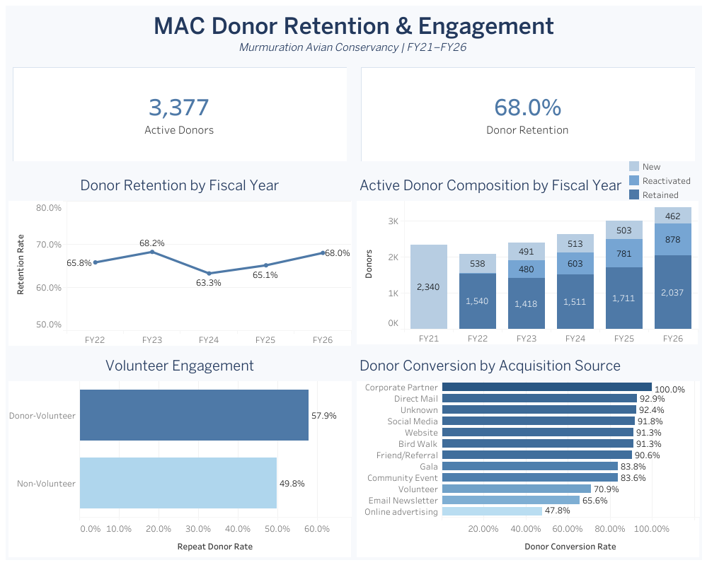
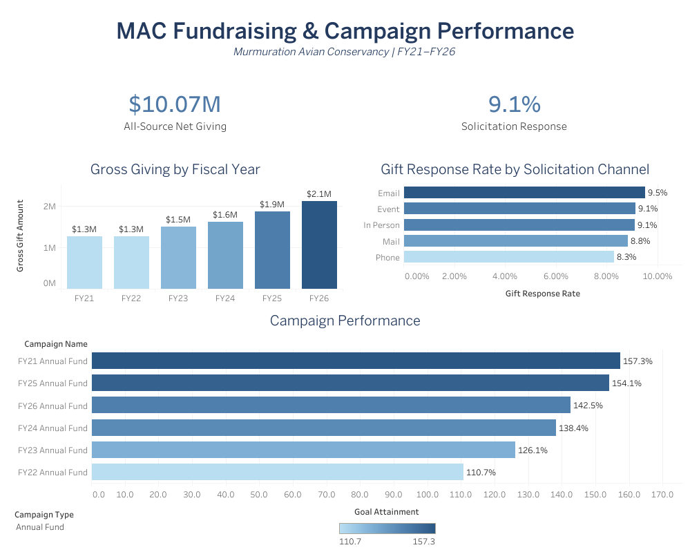

# Donor Retention & Fundraising Performance Analysis

An end-to-end nonprofit analytics portfolio project using Excel Power Query, MySQL, and Tableau to examine donor retention, fundraising growth, acquisition, volunteer engagement, campaign performance, and solicitation response across FY21-FY26.

> **Portfolio note:** Murmuration Avian Conservancy is a simulated nonprofit. The data is synthetic and anonymized.

[View the interactive Tableau dashboards](https://public.tableau.com/views/MAC_Donor_Retention_and_Giving/MACFundraisingPerformance)

## Dashboard preview

### Donor Retention & Engagement



### Fundraising & Campaign Performance



## Business problem

Nonprofit leaders need to understand whether fundraising growth is supported by durable donor relationships, which engagement channels warrant investment, and whether source-system changes distort performance reporting. This project addresses six questions:

- How have active donors, retention, and giving changed by fiscal year?
- What share of donors are new, retained, or reactivated?
- Which acquisition sources generate the strongest donor conversion?
- Does volunteer participation relate to repeat giving?
- Which campaigns perform best against fundraising goals?
- Which solicitation channels generate the strongest response?

## Dataset

| Dataset | Records | Purpose |
|---|---:|---|
| Constituents | 11,202 | Demographics, acquisition, contact preferences, status, and volunteer engagement |
| Gifts | 42,521 | Signed transactions, methods, campaigns, designations, and status |
| Campaigns | 31 | Campaign types, dates, and fundraising goals |
| Solicitations | 22,550 | Channels, ask amounts, responses, attribution, and solicitor type |

Source data is excluded from this public repository. The [data dictionary](data_dictionary.md) documents the analysis-ready fields.

## Tools and technical approach

- **Excel Power Query:** repeatable source preparation and initial profiling
- **MySQL 8.0:** raw-to-clean transformations, validation, relational joins, fiscal-year logic, cohort analysis, and reusable views
- **Tableau:** executive dashboards and interactive exploration

The SQL is organized into a dependency-safe sequence:

1. [`01_database_setup.sql`](sql/01_database_setup.sql) - raw landing schemas
2. [`02_data_profiling.sql`](sql/02_data_profiling.sql) - completeness, uniqueness, categories, and range checks
3. [`03_data_cleaning.sql`](sql/03_data_cleaning.sql) - analysis-ready tables and standardized fields
4. [`04_validation_checks.sql`](sql/04_validation_checks.sql) - row preservation, referential integrity, and exception checks
5. [`05_analysis_views.sql`](sql/05_analysis_views.sql) - reusable analytical layer
6. [`06_kpi_queries.sql`](sql/06_kpi_queries.sql) - dashboard and business-facing outputs

See the full [methodology](documentation/methodology.md) and [data-quality findings](documentation/data_quality_findings.md).

## Key findings

- Stable-source active donors increased from 2,078 in FY22 to 3,377 in FY26.
- Donor retention remained between 63.3% and 68.2%, reaching 68.0% in FY26.
- Donor-volunteers achieved a 57.9% repeat-giving rate versus 49.8% for non-volunteers.
- Stable-source gross giving increased from approximately $1.27M in FY21 to $2.12M in FY26.
- Email generated the highest solicitation response rate at 9.5%.
- Annual Fund campaigns achieved 110.7%-157.3% of goal.

## Material data-quality finding

One merged gift source covered only June 2023-June 2025, while the stable source covered FY21-FY26. The incomplete coverage reduced apparent FY25 retention to 44.6%.

I preserved the valid records, documented the coverage difference, and created a comparable stable-source cohort instead of deleting activity or manufacturing missing transactions. Stable-source FY25 retention was 65.1%.

## Recommendations

- Prioritize volunteer-to-donor stewardship because donor-volunteers demonstrate stronger repeat engagement.
- Use Email for scalable solicitation volume and deploy Event or Mail outreach strategically for larger gifts.
- Investigate Online Advertising's low conversion before increasing acquisition investment.
- Reassess Annual Fund targets because every displayed annual campaign exceeded goal.
- Add automated source-coverage monitoring during CRM migrations and vendor-feed integrations.

## Repository guide

```text
mac-donor-analytics/
├── README.md
├── data_dictionary.md
├── sql/
├── documentation/
├── dashboard/
└── executive_summary.pdf
```

- [Business requirements](documentation/business_requirements.md)
- [Methodology](documentation/methodology.md)
- [Data-quality findings](documentation/data_quality_findings.md)
- [Limitations](documentation/limitations.md)
- [Tableau Public link](dashboard/tableau_public_link.md)

## Limitations

This project uses synthetic data. Source-coverage differences require stable-source cohorts for comparable year-over-year analysis, and regenerated synthetic solicitation timing should not be interpreted as evidence of optimal real-world outreach timing. See the complete [limitations](documentation/limitations.md).
